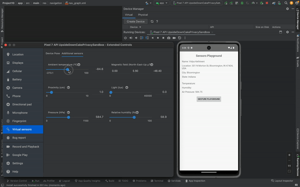
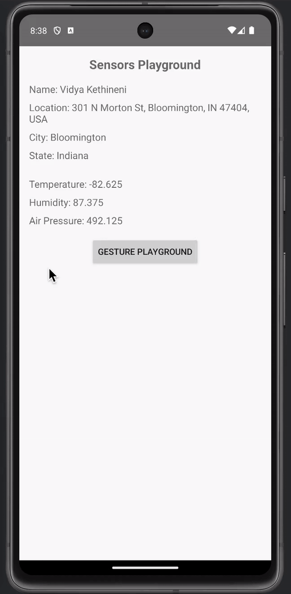
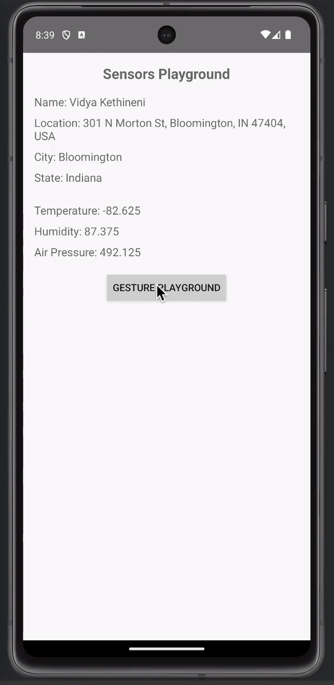

# Project 10

Project 10 involves the development of a mobile application using Jetpack Compose, specifically focusing on showcasing gesture and sensor APIs. The app comprises of three activities: Sensor Activity (First Activity), Gesture Activity (Second Activity) and the Third Activity.

## Functionality 

The following **required** functionality is completed:

- The Sensor Activity user interface displays personal information, including Name, Location (State and City), Current Temperature, Humidity and Air Pressure.
- Additionally, a button labeled "Gesture Playground" facilitates navigation to the Gesture Activity through a fling operation, as well navigation to the Third Activity through a click operation.
- The Gesture Activity consists of two fragments within the activity layout, where the top fragment displays a red ball that responds to user gestures and moves  moves across the screen based on the user's gestures.
- The bottom fragment of the Gesture Activity provides a log of activities performed in the top fragment. For every gesture, the app updates the log in the bottom fragment.
- The Third Activity replicates the Gesture activity but employs a accelerometer sensor to move the ball within the fragment. This activity does not include a list of gestures.

## Extensions

Potential extensions include:
- Utilize keyboard buttons to replicate gestures as an accessibility feature for users with disabilities.

## Video Walkthrough

Here's a walkthrough of implemented user stories:

GIF created with [EzGif](https://ezgif.com/) 

## Notes

Challenges encountered during the coding process included:
  - Ensuring precise recognition of a variety of gestures
  
## License

    Copyright [2023] [Vidya Kethineni]

    Licensed under the Apache License, Version 2.0 (the "License");
    you may not use this file except in compliance with the License.
    You may obtain a copy of the License at

        http://www.apache.org/licenses/LICENSE-2.0

    Unless required by applicable law or agreed to in writing, software
    distributed under the License is distributed on an "AS IS" BASIS,
    WITHOUT WARRANTIES OR CONDITIONS OF ANY KIND, either express or implied.
    See the License for the specific language governing permissions and
    limitations under the License.
